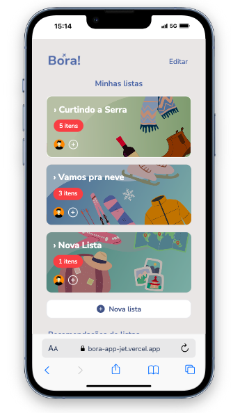

# 🧭 Bora! – Seu checklist de viagem perfeito

**Bora!** é um aplicativo web desenvolvido com **React + Vite + TailwindCSS**, pensado para ajudar pessoas a organizarem suas malas e listas de viagem de forma visual, rápida e inteligente. Com uma interface moderna e intuitiva, o Bora! é ideal para quem ama viajar sem esquecer nada!

[](https://opensource.org/licenses/MIT)
[](https://reactjs.org/)
[](https://bora-app-jet.vercel.app/)
[](https://github.com/juliabacchi1/bora-app)



---

## 🛠️ Tecnologias

- [React](https://reactjs.org/)
- [Vite](https://vitejs.dev/)
- [TailwindCSS](https://tailwindcss.com/)
- [React Router](https://reactrouter.com/)
- [Iconoir](https://iconoir.com/)

---

## 🚀 Instalação

```bash
git clone https://github.com/juliabacchi1/bora-app.git
cd bora-app
npm install
npm run dev
```

---

## ✨ Funcionalidades

- ✅ Seleção e marcação de itens para viagem
- 📦 Organização por **categorias** (roupas, higiene, tecnologia etc.)
- 💾 Armazenamento no `localStorage`
- 🧠 Sugestões recentes e favoritas
- 🧲 Opção de reorganizar itens por categoria
- 🎨 Design responsivo e agradável
- 🌍 Multiplataforma (funciona bem no desktop e mobile)

## 📂 Estrutura do projeto

```
src/
├── components/
│ ├── RecentlyUsed.jsx
│ ├── ListCard.jsx
│ ├── CategorySection.jsx
│ ├── ItemCard.jsx
│ └── RecommendationsCarousel.jsx
│
├── pages/
│ ├── Home.jsx
│ └── ListDetails.jsx
│
├── data/
│ ├── recommendedLists.js
│ └── mockItems.js
│
├── hooks/
│ └── useListaById.js
│
├── App.jsx
└── main.jsx
```

## 🧩 Em desenvolvimento

🔐 Implementar sistema de login e autenticação
🌐 Adaptar o roteamento com URLs mais amigáveis (ex: /listas/ferias)
☁️ Integração com backend para salvar dados em nuvem
📱 Publicação em app stores (com PWA)
💬 Adicionar suporte a múltiplos idiomas

## 💡 Inspiração
O Bora! se inspira em apps como Bring! e Notion, combinando a estética clean com funcionalidade inteligente. A ideia é transformar o planejamento de viagens em uma experiência leve e prazerosa.

## 🙋‍♀️ Feito por
Julia Bacchi – desenvolvedora front-end apaixonada por inovação, sustentabilidade e boas ideias.
[LinkedIn] (https://www.linkedin.com/in/juliabacchi/) | [Portfólio](https://juliadev.vercel.app/)

## 🪄 Contribuições
Quer contribuir com o projeto? Crie um fork, abra uma issue ou envie um pull request. Toda ajuda é bem-vinda! 💛

## 📄 Licença
MIT © Júlia Bacchi

